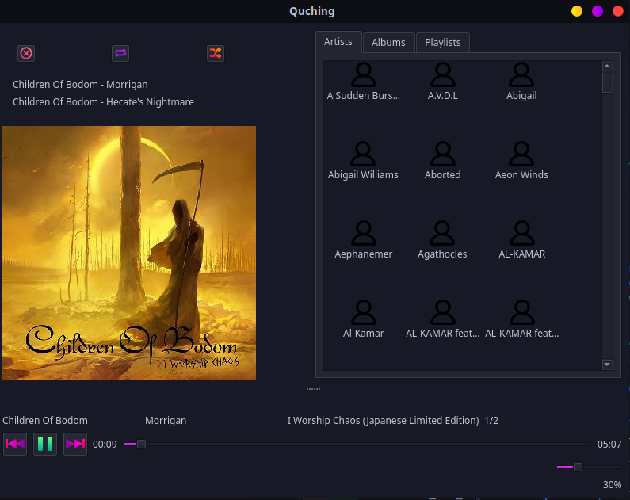

# Quching
Quching (pronouned Q-ching) is a music player written in Python and based on Qt. This is still a prototype so it's still bare bones and may heavily change in the future.




# Run
To run it, create a venv and install the requirements, then run it with:
```
python main.py path/to/audio/file
```